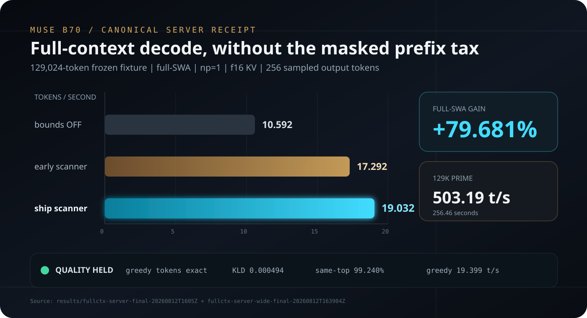

<p align="center">
  
</p>

# muse

Muse Glimmer 30B (Q4_K_M, 15.6 GB) on Intel Arc Pro B70. One seat, full 131k context.
**Dense 28B** — not a Laguna/Qwen MoE. Every token rereads the whole 15.6 GB.

Serving package (script + template, weights stay on Meta):
[Frosty40/Muse-Glimmer-30B-ArcB70-GGUF](https://huggingface.co/Frosty40/Muse-Glimmer-30B-ArcB70-GGUF)

| | |
|---|---|
| decode @ 129k cached | **19.0 t/s** |
| full-ctx prime | **503 t/s** |
| short decode / prefill | 28.6 / ~1277 t/s |
| quality | exact greedy vs controls · KLD 0.000494 |



## Install

Needs an Arc B70, Intel oneAPI, and Meta's kquant (not in git):

```bash
git clone https://github.com/newjordan/museB70.git
cd museB70

hf download meta-models/Muse-Glimmer-30B-GGUF muse-glimmer-30B-kquant-17gb.gguf
# sha256 7e9b74b7c8875e9e265695df9613bf6290f2392e479ce740495a129019c488d8

gh release download v2026.08.12-b70 --repo newjordan/museB70 \
  --pattern 'muse-serve-3ce44d373-linux-b70.tar.zst'
sha256sum -c releases/ASSET_SHA256SUMS
tar --zstd -C releases -xf muse-serve-3ce44d373-linux-b70.tar.zst
rm -f muse-serve-3ce44d373-linux-b70.tar.zst
```

Skip the binary download if `releases/muse-serve-3ce44d373/bin/llama-server` is already there.

## Serve

Anywhere with a SYCL `llama-server`:

```bash
MODEL=muse-glimmer-30B-kquant-17gb.gguf LLAMA_BIN=./releases/muse-serve-3ce44d373/bin/llama-server \
  ./serve-muse-arc.sh          # http://127.0.0.1:8095/v1
```

This box's pinned launcher (hashes, fleet lock, fail-closed profile):

```bash
./serve-muse.sh --check    # hashes + config, no GPU
./serve-muse.sh            # http://127.0.0.1:8095/v1
```

```bash
curl -s localhost:8095/v1/chat/completions \
  -H 'Content-Type: application/json' \
  -d '{"model":"muse-glimmer-30b-q4","messages":[{"role":"user","content":"hi"}],"max_tokens":128}'
```

- One GPU client at a time. The xe driver wedges if you stack this with Laguna, treebeard, or a bench.
- Localhost only. Use SSH or a TLS proxy for remote. Direct LAN HTTP is break-glass (`SERVE_ALLOW_INSECURE_NETWORK=1` + a mode-600 `SERVE_API_KEY_FILE`).
- Muse thinks in `reasoning_content`. Echo **both** that and `content` on later turns, and give it enough `max_tokens` (128 is the smoke default).
- Optional systemd template: `muse-b70.service` (not installed).

Fixed profile: `-np 1 -c 131072 -ub 4096 -b 4096 --swa-full`, f16 KV, API only. The launcher will not take other knobs.

## Bench

No GPU:

```bash
bash scripts/test-serve-preflight.sh
python3 scripts/test-fullctx-server-compare.py
```

Live smoke (takes the GPU lock):

```bash
bash scripts/smoke-test.sh
```

Re-run the published numbers (GPU lock, slower):

```bash
bash scripts/bench-sweep.sh ship -- -p 512 -n 128 -r 5
bash scripts/bench-fullctx-server.sh
```

Headline receipts: `RESULTS.md`. Raw files: `results/`. Kernel patches: `KERNEL_PROVENANCE.md`.
