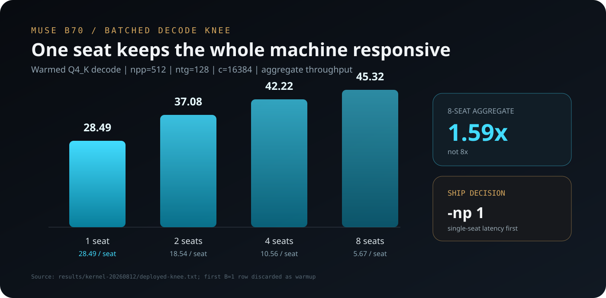

# Numbers

Receipts in `results/`. Campaign closed 2026-08-12.

## Ship

`releases/muse-serve-3ce44d373` · commit `3ce44d373`

`-c 131072 -np 1 -ub 4096 -b 4096 -fa on -ctk f16 -ctv f16 --swa-full`

`REORDER_MULTICOL_MKL=1` · `FATTN_PARALLEL_BLOCKS=24` · `FATTN_DECODE_MASK_BOUNDS=1` · `Q4_K_MMVQ_NCOLS_HOIST=1`

oneDNN off · SYCL graph off · no speculation

## Serving

| | t/s | receipt |
|---|---:|---|
| short prefill, steady | **1277** | `results/canonical-pp.log` |
| short decode | **28.6** | sweep + b70-profile |
| 129k prime | **503.19** | `results/fullctx-server-wide-final-20260812T163904Z/` |
| 129k full-SWA decode | **19.032** | same |
| same, bounds off | 10.592 | `results/fullctx-server-final-20260812T1605Z/` |

Full-SWA + bounds is **+79.7%** vs bounds-off, and keeps edit/branch cache reuse. Compact/ring SWA is a different cache (~19.7 t/s llama-bench) — do not mix the two.

## llama-bench (d0)

| leg | pp512 | pp4096 | tg128 |
|---|---:|---:|---:|
| control (DNN off, graph off, ub2048) | 933.1 | 1322.3 | 28.62 |
| ub4096 | 930.1 | **1336.1** | 28.64 |
| oneDNN on | 927.7 | 1315.7 | 28.66 |
| SYCL graph on | 927.5 | — | 28.63 |

Decode is the bandwidth wall (15.6 GB × 28.6 ≈ 446 GB/s). Knobs do not move d0 tg.

**Do not tune `REORDER_MULTICOL_MKL` with llama-bench.** llama-bench prefills before any decode, so it never sees the post-decode 61 t/s collapse. Measure that at the server.

## Multi-slot

| slots | TG agg | per stream |
|---|---:|---:|
| 1 | 28.4 | 28.4 |
| 2 | 37.1 | 18.5 |
| 4 | 42.2 | 10.6 |
| 8 | 45.3 | 5.7 |

~1.59× at 8 slots. That is why production is `-np 1`.

## Quality

| gate | result |
|---|---|
| greedy tokens/content vs OFF-A/OFF-B | exact |
| 129k probability vs OFF/OFF noise | pass |
| broad KLD | **0.000494** mean / **99.240%** same-top |

Sampled tails are not bit-stable even between OFF controls. Quality is greedy + noise-calibrated probs + KLD, not sampled coincidence.

Live release smoke: `results/serve-release-history-quality-20260812T1752Z.md`.
